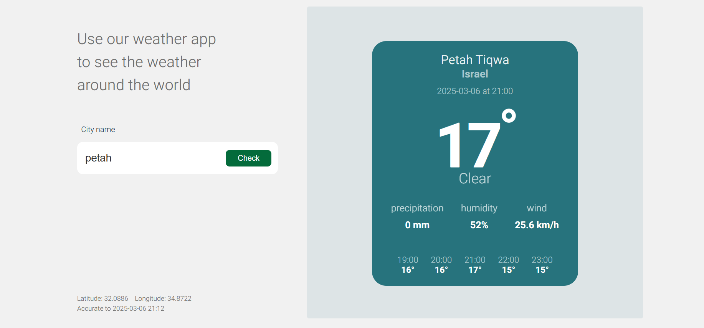

# Weather App 🌤️

A simple weather application built with **React** for the frontend and **Node.js (Express)** for the backend. The app allows users to search for a city's weather and displays real-time weather conditions.

## 📸 Preview

> Replace `./assets/weather-app-preview.png` with the actual path where your screenshot is stored.

---

## 📌 Features
- 🌍 Search for weather in any city worldwide.
- 🌡 Uses an external weather API.
- 📊 Displays current temperature, humidity, wind speed, and precipitation.
- 🥒 Shows hourly forecast (2 hours before and after the current time).
- 🎨 Responsive and clean UI.

---

## 🛠️ Tech Stack
### **Frontend**
- React.js
- CSS (custom styling)

### **Backend**
- Node.js with Express.js
- Axios for API requests
- dotenv for environment variables

---

## 🚀 Getting Started

### **1️⃣ Clone the Repository**
```sh
git clone https://github.com/sari705/weather-app.git
cd weather-app
```

### **2️⃣ Install Dependencies**
#### **Frontend**
```sh
cd frontend
npm install
```

#### **Backend**
```sh
cd backend
npm install
```

---

## 🏃‍♂️ Running the Application

### **Start the Backend Server**
1. Navigate to the `backend` folder.
2. Create a **.env** file and add:
    ```env
    WEATHER_API_KEY=your_api_key
    ```
3. Run the backend server:
    ```sh
    node server
    ```
   The server will run on `http://localhost:5000`.

### **Start the Frontend**
1. Navigate to the `frontend` folder.
2. Start the React app:
    ```sh
    npm run dev
    ```
   The frontend will be available at `http://localhost:3000`.

---

## 🐂 Project Structure

```
weather-app/
│── backend/               # Node.js Backend
│   ├── Controllers/       # API Controllers
│   ├── Routes/            # Express Routes
│   ├── node_modules/      # Backend dependencies
│   ├── .env               # Environment Variables
│   ├── .env.example       # Example Environment Variables
│   ├── .gitignore         # Git Ignore File
│   ├── package.json       # Backend Dependencies
│   ├── package-lock.json  # Backend Lock File
│   ├── server.js          # Main Express Server
│   ├── weather.js         # Weather API Service
│
│── frontend/              # React Frontend
│   ├── node_modules/      # Frontend dependencies
│   ├── public/            # Static Files
│   ├── src/               # Source Code
│   │   ├── assets/        # Static Images
│   │   ├── components/    # UI Components
│   │   ├── pages/         # Page Components
│   │   ├── services/      # API Requests
│   │   ├── styles/        # CSS Styles
│   │   ├── App.jsx        # Main React App
│   │   ├── App.css        # Main CSS
│   │   ├── index.jsx      # React Entry Point
│   │   ├── index.css      # Global Styles
│   │   ├── main.jsx       # App Entry
│   ├── .env               # Environment Variables
│   ├── .gitignore         # Git Ignore File
│   ├── eslint.config.js   # ESLint Configuration
│   ├── index.html         # HTML Template
│   ├── package.json       # Frontend Dependencies
│   ├── package-lock.json  # Frontend Lock File
│
│── README.md 

---

## 📝 License
This project is licensed under the **MIT License**. Feel free to modify and use it.

---

## 📩 Contact
If you have any questions, feel free to reach out!

📧 Email: sari125705@gmail.com
🐙 GitHub: sari705(https://github.com/sari705)

---

This **README.md** provides everything a user needs to **install**, **run**, and **understand** your project. 🚀 Let me know if you need any adjustments! 🎯

